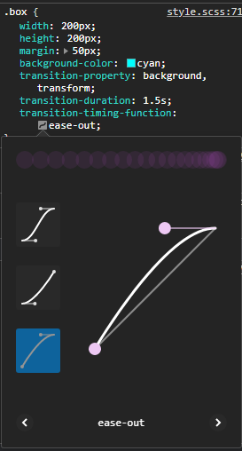

# CSS Animation


October 2020

> 🔨  CSS Animations. From udemy: [Les animations CSS en 9 projets](https://www.udemy.com/course/les-animations-css-en-9-projets/) 

* * *


Demo on [Github page](https://raigyo.github.io/css-animations/).

## Overview

### Pseudo classes:

A pseudo-class is used to define a special state of an element.

Ex: 

`:hover`, `:focus`,  `:active`, `:nth-child`

List of pseudo classes: https://developer.mozilla.org/en-US/docs/Web/CSS/Pseudo-classes

### Pseudo elements:

A CSS pseudo-element is a keyword added to a selector that lets you style a specific part of the selected element(s).

Ex:

`::before`, `::after`

List of pseudo-elements: https://developer.mozilla.org/en-US/docs/Web/CSS/Pseudo-elements

### Properties:

Ex:

 `transform: scale(2);`, `transform: translate(250px, 0px);`, `transform: rotate(45deg);`, ` transform: skew(20deg, 20deg);`

List of main properties: https://developer.mozilla.org/en-US/docs/Web/CSS/CSS_Properties_Reference

### Properties: transition

CSS transitions provide a way to control animation speed when changing CSS properties. Instead of having property changes take effect immediately, you can cause the changes in a property to take place over a period of time.

Defining transitions: https://developer.mozilla.org/en-US/docs/Web/CSS/CSS_Transitions/Using_CSS_transitions

Ex:

````scss
.box {
  width: 200px;
  height: 200px;
  margin: 50px;
  background-color: cyan;
  transition-property: background, transform;
  transition-duration: 1.5s; // 500ms = 0.5s = .5s
  // transition-delay: 1s;
  transition-timing-function: ease-out; // ease-in

  &:hover {
    background-color: crimson;
    transform: rotate(45deg);
  }
}
````

For `  transition-timing-function`, we can use Chrome developer tools



We can use the shortcut property.

The following code has the same result than the previous one.

Note: using 'all' can affect the performances of the page.

````scss
.box {
  width: 200px;
  height: 200px;
  margin: 50px;
  background-color: cyan;
  transition: all 1s ease-in;

  &:hover {
    background-color: crimson;
    transform: rotate(45deg);
  }
}
````


## Useful links

- [Ziratsu/Cours-anim-CSS](https://github.com/Ziratsu/Cours-anim-CSS)
- [Ziratsu/Projets-formation-Animations-CSS](https://github.com/Ziratsu/Projets-formation-Animations-CSS)
- [cubic-bezier](https://cubic-bezier.com/)
- [radial-gradient](https://developer.mozilla.org/en-US/docs/Web/CSS/radial-gradient)
- [filter](https://developer.mozilla.org/en-US/docs/Web/CSS/filter)
- [drop-shadow](https://developer.mozilla.org/en-US/docs/Web/CSS/filter-function/drop-shadow)
- [CSS clippath maker](https://bennettfeely.com/clippy/)